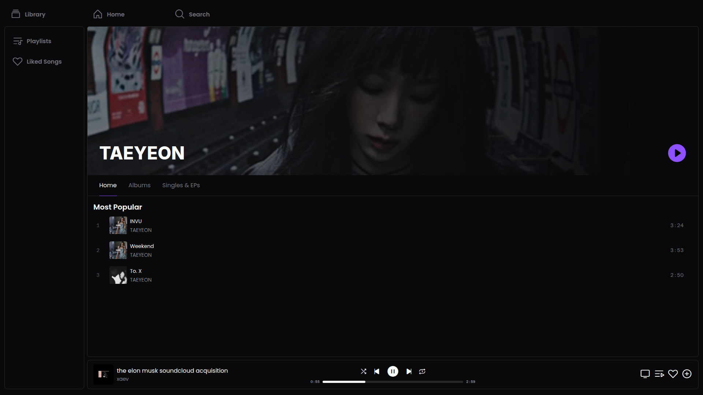
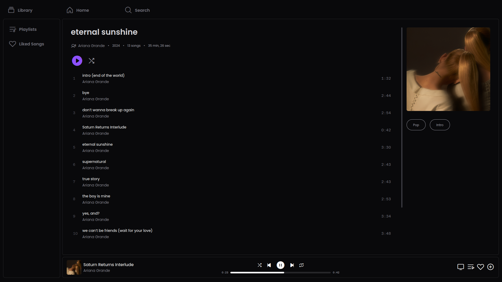

##

> 🎼 A simple self-hosted Subsonic web client.

Somachord is a music player for Subsonic servers on the Web made to rule over all
the others.

# Features

- It plays music!
- It's written in [Gleam](https://gleam.run/)
- Has a straightforward UI
- Works on Mobile and Desktop
  - PWA
  - Electron
  - Web/Browser
- Works **offline**, which means you can play music without an internet connection (if you've played it once already)
- Lyrics, synced or unsynced
- Scrobbles to Subsonic server
- Autoplay similar music when the queue is finished
- Saves and restore queue
- Playlist management

Request features you would like as an [issue](https://github.com/sammy-ette/Somachord/issues/new)
and I may or may not work on it.





# Setting Up
## Docker
The easiest way to get Somachord up and running is by using Docker.

Pull it from ghcr.io:  
```shell
docker run -p 8000:8000 -it ghcr.io/sammy-ette/somachord:master
```

Or build it locally:  
```shell
docker build -t somachord .
docker run -p 8000:8000 -it somachord
```

### Compose
```yml
services:
  somachord:
    container_name: somachord
    image: ghcr.io/sammy-ette/somachord:master
    environment:
      - SERVER_URL=https://example.com # optional
    ports:
     - 8000:8000
    restart: unless-stopped
```

## Source
You can also run Somachord from source as a test.
```shell
git clone https://github.com/sammy-ette/Somachord
cd Somachord
gleam run -m lustre/dev build --minify
cd server && gleam run
```

# Developing Somachord
To setup a development environment to test out local changes, you need Gleam and rebar3 installed.
I will not detail how to install those.

When developing it's better to use the Lustre dev server:
```shell
gleam run -m lustre/dev start
```

When making changes it will reload the site automatically.

# License
Somachord is AGPL 3.0 licensed.
